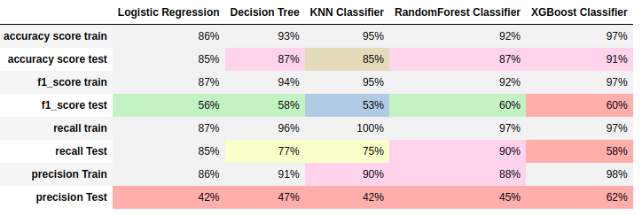

# Bank Subscription Prediction Machine Learning Project

## About
This project focuses on whether customer will subscribe for the bank schemes or not. It is a binary classification problem which will help bank to get the outcome from customer.

### Dataset
* [Dataset](https://www.kaggle.com/datasets/berkayalan/bank-marketing-data-set) link from kaggle.

* Dataset after Preprocessing

* Seasonal Decomposition of the Time-Series after order-1 differencing (to make it stationary)

* Correlation Plots 

* Best Results (GARCH + SARIMAX) (RMSE: 154.32)

### ML Models Used:
* Classification Models
     * Logistic Regression
     * Decision Tree Classifier
     * KNN Classifier
     * RandomForest Classifier
     * XGBoost Classifier
  
### Models Report:
    

### Python Dependencies:
* pandas
* numpy
* pickle
* matplotlib
* statsmodels
* seaborn
* sklearn
* django

### Install Dependencies (requirements.txt)
1. pip install -r requirements.txt

### How to Run
1. cd \<PROJECT ROOT DIRECTORY\>
2. python \<filename\>.py

### File Descriptions:
* auto-ARIMA.py: Runs automated gridsearch from pmdarima library, to find the best model parameters.
* AR.py, ARMA.py, ARIMA.py, SARIMAX.py use the above found best parameters to train the respective models as per their filenames.
* GARCH-SARIMAX.py runs SARIMAX models added with error of residuals from SARIMAX using GARCH.
* elasticnet.py runs Linear Regression with a combination of L1 and L2 penalty.
* bayesian.py runs BayesianRidge regression with optimal parameters.
* polyreg.py runs Linear Regression by adding polynomial features.
* var.py runs runs VAR model on the data.
